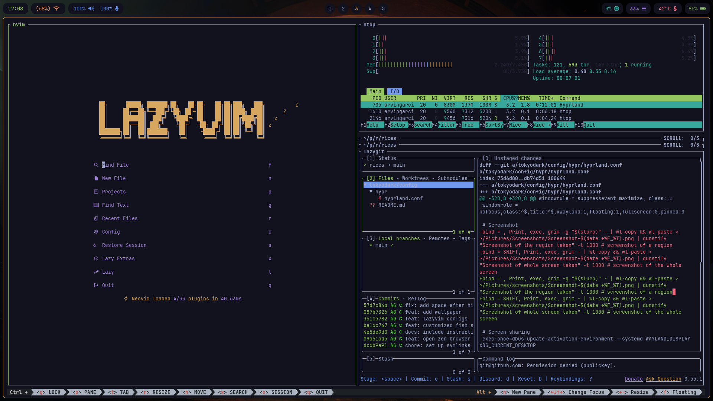

<h1 align="center">
  Tokyodark
  <h4 align="center">A rice based on the <a href="https://github.com/tiagovla/tokyodark.nvim" target="_blank">tokyodark</a> Neovim color theme</h4>
</h1>



***NOTE***: I am still pretty new to this, so some stuff may break on your end if you try to use my rice. Everything went alright when I used this rice on another device of mine, but your experience may differ.

Make sure to at least go through this [master tutorial](https://wiki.hypr.land/Getting-Started/Master-Tutorial/) from the Hyprland wiki for the necessary installation steps, especially the [critical software](https://wiki.hypr.land/Useful-Utilities/Must-have/) needed for a smooth Hyprland experience.

```bash
# Clone dotfiles
git clone https://github.com/arvingarciabtw/rices.git

# Install packages
sudo pacman -S hyprland dunst fish fontconfig ghostty nvim waybar wofi zellij oh-my-posh

# Create the symlinks (make sure ~/.config exists)
mkdir -p ~/.config
ln -sf ~/dotfiles/config/hypr ~/.config/hypr
ln -sf ~/dotfiles/config/dunst ~/.config/dunst
ln -sf ~/dotfiles/config/fish ~/.config/fish
ln -sf ~/dotfiles/config/fontconfig ~/.config/fontconfig
ln -sf ~/dotfiles/config/ghostty ~/.config/ghostty
ln -sf ~/dotfiles/config/nvim ~/.config/nvim
ln -sf ~/dotfiles/config/waybar ~/.config/waybar
ln -sf ~/dotfiles/config/wofi ~/.config/wofi
ln -sf ~/dotfiles/config/zellij ~/.config/zellij
```

The wallpapers I use are inside the `wallpapers/` directory.
